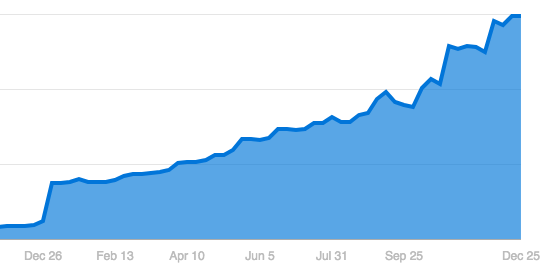
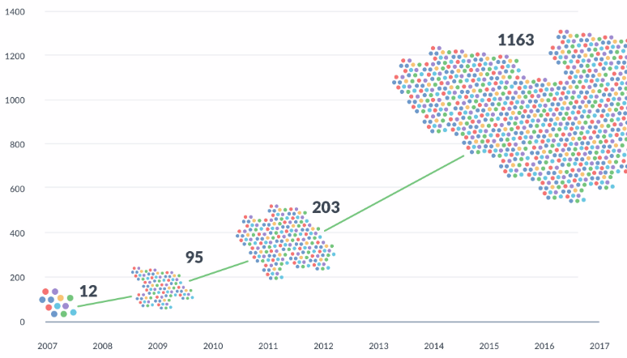
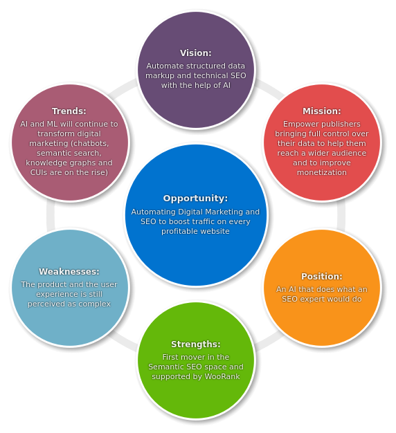
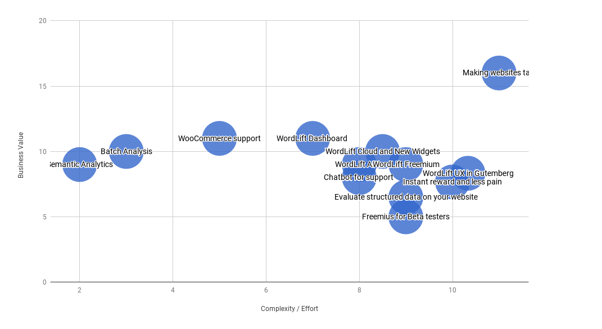

<!-- $theme: gaia -->
<!-- template: gaia -->
<!-- $size: 16:9 -->

# 
## ==ROADMAP== 2018
#### AI-powered ==SEO==
#####  

###### Created by the [WordLift Team (@wordliftit)](https://twitter.com/wordliftit)

---
<!-- *template: invert -->

> The **Artificial Intelligence** you need to grow your audience.
>
> <small>-- *[from the WordLift website](https://wordlift.io)*</small>

---
<!-- page_number: false -->

# What's in this presentation
#### Our **startup**  is **1 year old**! :hatching_chick:

- ==**It's time to think about:**==
	1. State of the Word(*Lift*)
	2. Strategy 
	3. Goals for the Year
	3. Major Initiatives 
	4. Planning and Releases

---

# ==1.== State of the ==Word(*Lift*)==

---
<!-- page_number: true -->
<!-- *template: invert -->
# Where we're standing

- **13.500+** downloads
- **200+** active installations 
- **11.4%** revenue monthly growth (:clap:)
 

---
<!-- *template: invert -->
# Product Challenges ==1==/3
### what we ==learned== from ==our users== :

1. Building the **==vocabulary==** is *painful* 
2. The initial **==learning curve==** is *steep*
3. The **==analysis==** *not always works* as it should
4. Automatically publishing *all* **==entity pages==** is *scary* 
5. **==Images==** from the Commons are *crap*

---

<!-- *template: invert -->
# Product Challenges ==2==/3
### how ==the world== around us ==is changing==:

6. **==Gutenberg==** will fundamentally transform *WordPress* 
7. **==Voice Search==** will get *bigger* and **==PASO==** will become *key* for brands (small and large)
8. Google **==Knowledge Graph==** will get *more important* than **featured snippets**
9. **==Chatbots==** and **==Instant Messaging==** will *drive traffic*
10. **==Graph==** is the **enterprise** *data model* for the next 20+ yrs
---
<!-- *template: white -->
<!-- page_number: false -->
### ==Linked Data== will continue to grow ==exponentially== 

	LINKED OPEN DATA NODES OVER TIME

---
# 438.674

## ==Entities== published in LOD with ==WordLift==
##### Our **most important** ==KPI==  of the year

---
<!-- *template: invert -->

 
 
 
 

> A new set of ==tools== will emerge ==to make the publication of Linked Data== something that can be accomplished ==without having to become an expert.==

<small>-- *[from Data.World - "How Linked Data creates data-driven cultures"](https://data.world)*</small>

---

<!-- *template: invert -->
# Product Challenges ==3==/3
#### ==Too Much== - ==Too Early==

> we have a tendency to ==**over-strech project goals**== and **==keep features as open as  possible==**. 
> This is good when building *MVPs* or *prototypes* but **it didn't help us ==meet the market==**.

 

### LET'S AVOID IT! 

---

<!-- page_number: false -->

# ==2.== Strategy

---
<!-- *template: default -->
<!-- page_number: false -->

---
# In a nutshell :chestnut: here is what we can  do 

1. **Make WordLift** ==**easy to use**== and ==**agentive**== (*weekly digests*, *dashboard*, ...) :point_right: we need to *create* and *nurture* an **==open channel==** with our clients
2. Focus on `VIP Clients` and **end-to-end services** on top of ==**WordLift**== and ==**WooRank**==
3. **Train clients on the technology** and always be `innovative`
4. Bring ==**WordLift Cloud**== to ==**WooRank**==  
5. **Make ==websites talk==**
6. Build the **==Italian market==**
---

<!-- page_number: false -->
## Personas :person_with_pouting_face::boy::man::person_with_blond_hair:
##### Let's meet ==our clients== 
---
<!-- page_number: true -->
<!-- *template: invert -->

# Sara :person_with_pouting_face:
- She is the ==editor in chief== of a magazine (print and online) that talks to a niche audience
- She ==struggles with traffic== and cannibalizes her organic visits with paid ads
- Ramia's focus is on ==branding== and ==user experience==
- She is an `innovator` and a ==savy business woman==

---
<!-- *template: invert -->

# Dorian :boy:
- He is an ==IT specialist== and **runs a blog** dedicated to coffee **in his spare time** with great care and professionalism 
- He also has ==trouble with the organic traffic==, competition is high in his sector  
- Dorian is focused on ==SEO==, ==great content== and ==understands the value of data== 
- He is an `innovator` and a ==techy== 

---
<!-- *template: invert -->
# Ulf :man:
- He is an ==online publisher== and the main property serves content for a wide audience 
- He is looking for ==growth== and ==monetization== (he is moving away from advertising) 
- On the main site he needs ==better engagement== and a ==stronger marketing mix== 
- Radu is a technical writer with a ==clever SEO approach== and a ==great entreprenurial spirit==  
- He is an `innovator` and a ==startupper== 

---
<!-- *template: invert -->
# Jason :person_with_blond_hair:
- He is a ==marketer== and works inside an organization  
- He is looking for ==growth==, ==innovation== and ==network effect== (he handles multiple properties and has partners to take care of) 
- Rainer is a *Pro* marketer that ==understands semantic technologies==, ==structured data== and the power of ==graph databases==  
- He constantly looks for `innovation` to improve his organization 
- He needs to ==demonstrate value== internally 

---
## Personas wrapup :person_with_pouting_face::boy::man::person_with_blond_hair:

|Name|Profession|Goals|Likes|
|:--|:-:|:--|:--|
|**Sara**|Editor in Chief|- grow traffic  - improve branding  |- organic growth  - consultancy  - innovation 
|**Dorian**|Blogger|- grow traffic  |- technology  - SEO  
|**Ulf**|Publisher|- grow traffic  - better engagement   - more traffic sources|- organic growth  - consultancy   - innovation  
|**Jason**|Marketer|- grow the network  - visibility   |- innovation  - open data  

---
<!-- page_number: false -->

# ==3.== Goals for the year

---
<!-- page_number: true -->
<!-- *template: invert -->
# Upgrading 2018

1. **provide ==top-notch SEO services==** to `VIP clients`  
2. **grow** ==**active installs**== to **600** (including *Cloud* and *APIs*) 
3. **go live** with **==WordLift Cloud==** and a **==streamlined user experience==**
4. **do ==magic==** with **WooRank** by combining `expertise`, `tacticts` and `technology`
5. **launch a ==chatbot companion==** to ==**make websites talk**== using structured data 

---
<!-- page_number: false -->

# ==4.== Major initiatives

---
<!-- page_number: false -->
<!-- *template: invert -->
# Product ==Roadmap== 2018 ==1==/2 :rocket: 
|Initiative|Type|Target|
|:--|:--|:--|
|1. ==**Dashboard**==, keywords and digest by ==**WooRank**==|Big Bet|Sara, Dorian 
|2. WordLift UX in **==Gutenberg==**|Loser | All|
|3. **==WordLift Cloud==** and **new widgets**|Big Bet|All
|4. **Instant reward** with **==better images==**, **==startup vocabulary==** and **==structured data validator==**|Loser|Dorian, Sara
|5. **==Making Websites talk==**|Big Bet|Sara, Jason, Ulf
---
<!-- page_number: false -->
# Product ==Roadmap== 2018 ==2==/2 :rocket: 

|Initiative|Type|Target|
|:--|:--|:--|
|6.  ==**WooCommerce**== Support|Winner|Dorian
|7. **Batch Analysis**| Winner | Jason, Ulf, Sara
|8. **==Chatbot== for ==support==**|Loser| All
|9. **Semantic Analytics**| Maybe | Jason, Ulf, Sara
|10. **WordLift ==APIs==** | Loser | -
|11. **WordLift ==Freemium==** | Loser | -
|12. **Track usage** for *beta testers*| Loser |-
---
<!-- *template: default -->

---
<!-- *template: invert -->

|Winners| Losers | Big Bets |Maybes| 
|:--|:--|:--|:--|
|==**WooCommerce**== integration|**Gutenberg** |**==Making Websites Talk==**|**Semantic Analytics**|
|==**Batch Analysis**==|**Instant reward** |**==WordLift Dashboard==**|
||**Evaluate Structured Data** |**==WordLift Cloud & New Widgets==**|
||**Chatbot for support** ||
||**WordLift Freemium** ||
||**WordLift APIs** ||
---

# 

### You can find more details 
#### in the ==roadmap== document  :bookmark_tabs:
#### [on Google Drive](https://docs.google.com/document/d/16Is1RpYO-2PaSKrElFr5_ky1p7kvcSQkiaySWfRQUi0/edit?usp=sharing)

---

# ==5.== Planning and Releases

---

# Milestones :calendar:

|Initiative| Release | Planning| 
|:--|:-:|--:|
|1. ==**Dashboard**==, keywords and digest by ==**WooRank**==|3.18 |Q1
|2. **==WooCommerce==** integration| 3.19 |Q1
|3. **==Instant reward==** ph. 1 w/ **structured data validator**| 3.20 |Q1
|4. WordLift UX in **==Gutenberg==**|4.0|Q2
|5. **==Instant Reward==** ph. 2 w/ with better images| 4.1|Q2
|6. **==WordLift Cloud==** and **new widgets**|4.5| Q2/Q3|
|7. **==Making Website Talk==** and **support chatbot**|4.6| Q3/Q4|

---
# Research and Development Work :gem:
#### what are we experimenting with?

- ==**Content summarization**== this is **crucial** for chatbot and could be also a solution to `missing meta descriptions`
- ==**Conversational UIs**== and ==**Voice Search**==  to improve the engagement on content or to help users find it 
- **Automatic ==Image captioning==** for `missing alt tags`
- **==Content crawling==** for `vocabulary seeding` (feeding the graph with content crawled from the web)
- ==**Q&A**== content extraction and ==**ChatPal**== by Redlink

---
# 
## ==Thank== You!
